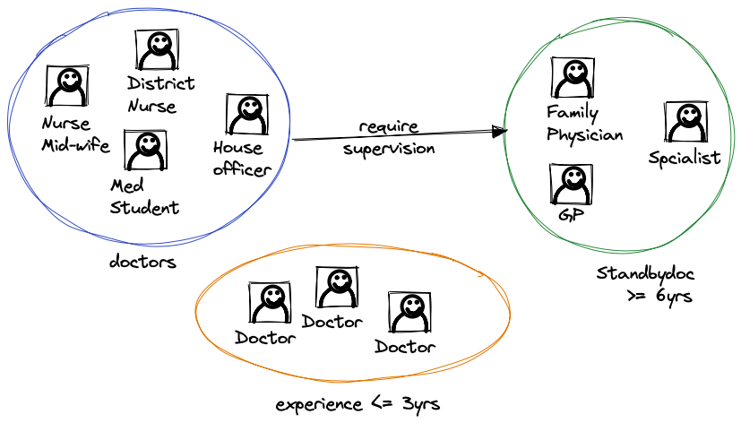
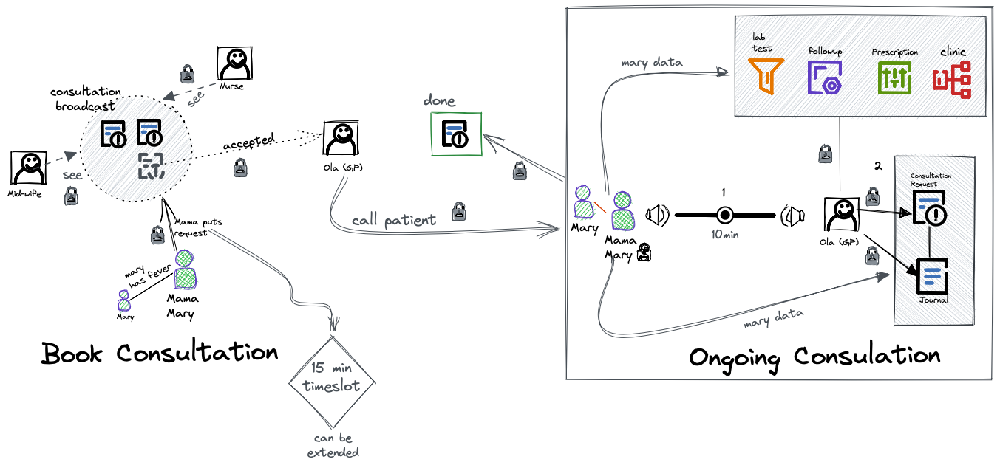

# Carelyo Medical Professional Services

### Doctor Services Introduction
> This service is a platform for freelance medical professionals such as doctors, district nurses, nurse-midwife, family physicians, genaral practitioners, etc. To offer virtual medical consultation services to patients on demand. Such as medical advices, drug prescription, referral to hospital, lab test placement etc.

## Benefits
> * No data fee
> * Perform easy consultation 
> * Earn per consultation
> * Professional profile
> * CV formating

## Role
> There is one main role called Medical Professional

### Sub Role
> * Standbydoc
> * doctor
> 

### Functions of Standbydoc
> Refers to a medical professional with over 5 years experience with a valid license [MDCN] (Medical and Dental Councel of Nigeria).
>
> 1. Can perform consultation.
> 2. Responds to urgent concerns of medical professionals assigned to them.
> 3. Alter wrong or incorrect prescriptions.
> 4. Respond to urgent request from pharmacist to resolve flagged prescriptions cases.
> 5. StandByDoctors can be assigned for more than one Doctor.

### Functions of a Doctor 
> Refers to a licensed medical professional or a medical student in training.With a valid license [MDCN] (Medical and Dental Councel of Nigeria) or proof of study in a Nigerian medical school or college.
> 
> 1. Also known as regular doctor.
> 2. Must be assigned to a Standbydoc
> 3. Cannot be assigned to two StandBydoc
> 4. Can perform consultation.

## Profile
### Medical Professional's Profile For Standbydoc
> - Title 
> - FirstName
> - LastName
> - Age
> - Gender
> - Mobile
> - Email
> - Languages (click one or more: Igbo | Yourba | Hausa | English )
> - Academic Qualifications
> - Current Employment | Student
> - Training | Specialty
> - University Studied | Studying
> - Professional Development
> - Assigned 
> - References
> - Role = Standbydoc
> - List assigned doctors

### Medical Professional's Profile For doctors
> - Title 
> - FirstName
> - LastName
> - Age
> - Gender
> - Mobile
> - Email
> - Languages (click one or more: Igbo | Yourba | Hausa | English )
> - Academic Qualifications
> - Current Employment | Student
> - Training | Specialty
> - University Studied | Studying
> - Professional Development
> - Assigned 
> - References
> - Role = doctor
> - Assigned Standbydoc

## Dashboard
> - Welcome greetings (Hi Dr Mary)
> - Avartar
> - Last login
> - Online Status
> - Performace
> - Calendar
> - Accepted Consultations
> - Declined Consultation
> - Done Consultation
> - Earnings
> - Urgent Concerns (Standbydoc)

## Consultation

> - **Consultation broadcast**
> - - Lists all request from patients
> - - - Each request has a timeslot 10 min | 15 min | 25 min
> - **Accepted consultation**
> - - show all accepted consultations
> - - Ongoing consultation
> - - Extend timeslot
> - - Start | End 
> - - Audio | Chat | Video
> - - Add services: Prescription | Hospital visit | Lab | Digital followup 
> - **Done consultation** 
> - - List completed consultations 
> - **Urgent concern**
> - - List concerns from pharmacist or doctors