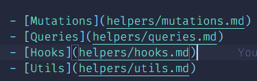

# This _[page]_ does not exist - 404

> Create a `[page].md` file in the `./docs` directory and link it to the sidebar in `_sidebar.md` if it doenst exist there already
>
> `_sidebar.md Links`
>
> 
>
> [:fas fa-home: BACK TO HOME](index.md)
