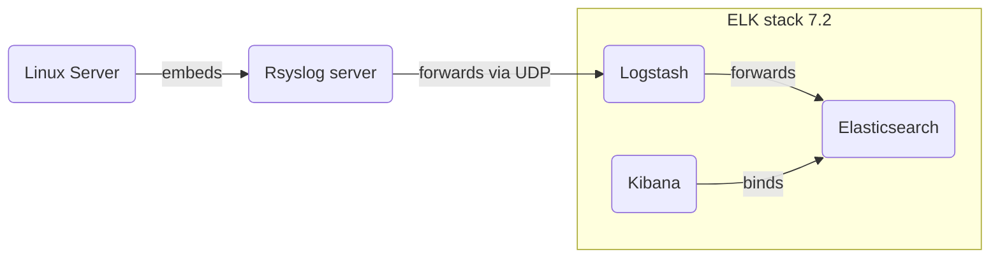

# Logging 

> ## Logging Documentation
Logging of running docker containers, nodes (computes instances), etc. 

> ## Run with docker-compose of ELK Stack
[git clone] (https://github.com/deviantony/docker-elk) \
cd /docker-elk \
docker-compose up -d

> Links
> * [Monitoring Linux Logs with Kibana and Rsyslog] https://devconnected.com/monitoring-linux-logs-with-kibana-and-rsyslog/
> * [Mermaidv8.13.8 Live Editor] https://mermaid-js.github.io/
> * [mermaid] https://mermaid-js.github.io/mermaid/#/flowchart

