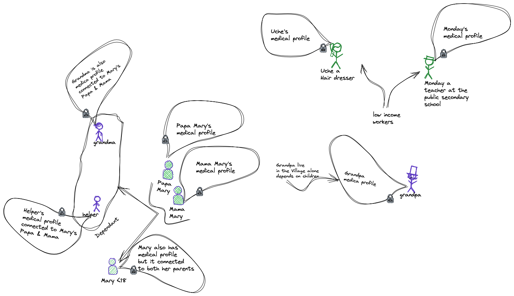
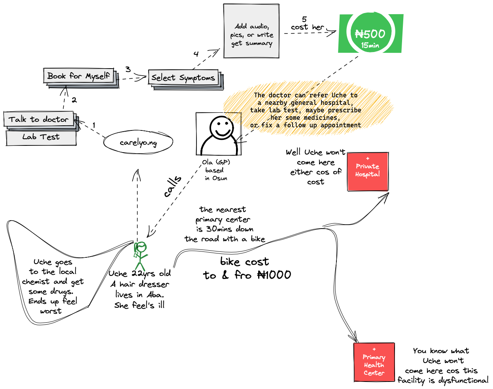

# Carelyo Patient Services

## Patient Services Introduction
> The patient service makes it possible for a patient to seek virtual medical consultation. When the patient visits an hospital on reference, the hospital personel can attened to the patient via the system.

## Types of patients 
> 1. Local patient 
> 2. Patient living abroad

## A Patient
> - Adualt Patient (<18)
> - Child of and Adualt
> - Dependent (Elderly, house maid, relative etc, someone in the Adualt Patient's care)
> 

## What is on the Dashbord

### Talk to doctor
> - Booking for Myself
> - Booking for Child
> - Booking for Dependet
> - - - Dependent is someone under the adults care i.e. helper, elderly, familiy relative

### Inbox
> - Messages
> - Consultation history
> - Journals

### Appointment
> - Hospital Visit
> - Lab Tests
> - Drug Prescriptions
> - Digital follow up

### Others
> - Invite friend
> - Profile
> - Support
> - Feedback
> - Wallet
> - Settings
> - - Language

## Newly Registered Patients
> Newly registered patients must complete their medical profile to use all services except the inbox which gives them access to messages that CARELYO sends them.

### Complete Profile
> Can be accessed by clicking
> - Please complete your profile and
> - All other buttons or tabs
> - Excluding Inbox and buttons within it. 

## Patient Profile
This includes:

### Local Patient
> - Title
> - Nationl Identity Number
> - Firstname
> - Surname
> - Date of bith
> - Gender
> - Marrie | Divorced | Single
> - Living alone Yes | No
> - Weight
> - Height
> - Previous Medical issue
> - Allergies Yes | No
> - Tribe
> - Occupation
> - Religion
> - Blood type
> - Disability
> - Preferred Language
> - Country (if countris is outside Africa then ask Purpose of visit)
> - State
> - Community
> - Address
> - Post Code
> - Purpose of visit Tourist | Expatriate | Business Trip (applicable to patient living abroad)
> - Add children
> - Add Dependent
