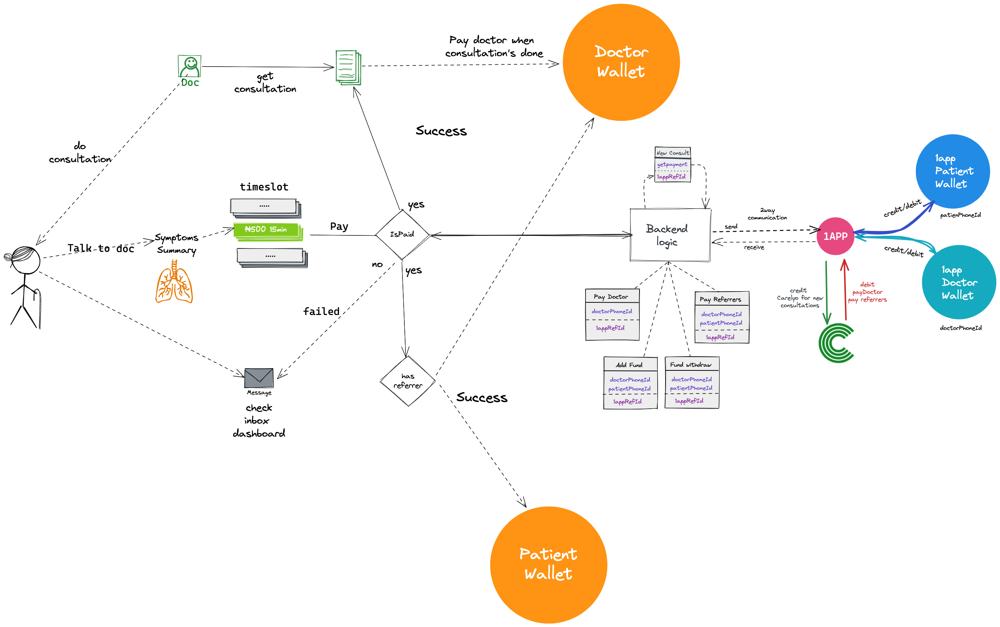

# Carelyo Payment Services

## Handling of Payment

## Medical Consultation Payment
> Medical consultation is paid upfront bfore consultation request is sent to doctors.

## Booking Process
1. For who?
2. Select symptoms and summary
3. Pick duration
4. Pay (1app API)
5. If payment is successful:
   - Send request to Doctors
   - Perform consultation
6. Unsuccessful
   - Notify patient of failed payment
7. Done consultation
   - Credit Doctor for done consultation
   - Credit Doctor if referrer of another doctor
   - Credit Doctor if referrer of patient
   - Credit Patient if referrer of patient
   - Credit CARELYO

## Payment Provider
> 1app [1app](https://1app.online/)